# DATABASE_RELATIONSHIP  [VERIFIED-VB6 - inferred from actual joins in code]

Relationships below are taken from JOIN clauses observed in decompiled SQL
(e.g. Night Audit room query, stock queries, folio queries). Live FK metadata
still pending (DB not reachable) — re-verify with sys.foreign_keys later.

```mermaid
erDiagram
    BOOKING ||--o{ GUESTFOLIO : "BookingDocId (arrival converts booking)"
    BOOKING ||--o{ BOOKINGMORE : "Docid (extra guest names)"
    BOOKING ||--o{ BOOKINGCANCELDETAILS : "BookingDocID (cancellation)"
    BOOKING ||--o{ GRPBOOKINGDETAILS : "group booking rows"
    GUESTFOLIO ||--o{ ROOMOCC : "DocId (folio header -> room rows)"
    GUESTFOLIO ||--o{ GUESTFOLIOPROFDETAIL : "Docid (guest profile links)"
    GUESTFOLIO ||--o{ GUESTFOLIOAMEND : "FolioNo (date amendments)"
    GUESTFOLIO ||--o{ PAYCHARGE : "FolioNo / FolioNoDocid"
    GUESTFOLIO }o--|| GUESTPROF : "GuestProf code"
    GUESTPROF }o--|| GUESTSTAT : "GUESTSTATUS"
    GUESTPROF }o--|| CITY : "City"
    GUESTFOLIO }o--o| SUBGROUP : "Company/TravelAgent (account)"
    ROOMOCC }o--|| ROOMMAST : "RoomNo"
    ROOMOCC }o--|| ROOMCAT : "RoomCat"
    ROOMOCC }o--|| PLANMAST : "PlanCode"
    ROOMMAST ||--o{ ROOMBLOCKOUT : "room blocking"
    PAYCHARGE }o--|| REVMAST : "PayCode/RevCode (revenue head)"
    PAYCHARGE }o--|| DEPART : "RestCode (outlet)"
    PAYCHARGE ||--o| PAYCHARGEH : "history copy"
    PAYCHARGE ||--o{ PAYCHARGELOG : "posting audit"
    ENVIRO ||--o{ NIGHTAUDITLOG : "LogSite_Code (date roll record)"
    VOUCHER_TYPE ||--o{ VOUCHER_PREFIX : "V_Type + LogSite_Code (numbering)"
    SALE1 ||--o{ SALE2 : "DocId (POS sale header/detail)"
    SALE1 ||--o{ KOT : "KOT tickets"
    KOT }o--|| ITEMAST : "Item"
    KOT }o--|| DEPART : "outlet"
    STOCK }o--|| ITEMAST : "Item"
    STOCK }o--|| ITEMCATMAST : "via item"
    ITEMAST }o--|| UNITMAST : "IssueUnit"
    PURCH1 ||--o{ PURCH2 : "DocId (purchase header/detail)"
    HALLBOOK ||--o{ HALLSALE1 : "banquet billing"
    HALLBOOK }o--|| VENUEMAST : "venue"
    HALLBOOK }o--|| FUNCTIONTYPE : "function type"
    MEMBERSHIPMAST ||--o{ MEMBILL : "member billing"
    MEMBERSHIPMAST ||--o{ MEMBERFAMILY : "family members"
    MEMBERSHIPMAST }o--|| MEMCATMAST : "category"
    EPABX_IN }o--|| TELEXTENSIONMAST : "extension (Jet mdb side)"
    EMPLOYEE }o--|| PRCATEGORYMAST : "category"
    EMPLOYEE }o--|| PRDESIGMAST : "designation"
    EMPLOYEE ||--o{ LOAN : "employee loans"
```

## Join examples found in code [VERIFIED-VB6]
- Night Audit occupied-room query joins RoomMast→RoomOcc→GuestFolio→GuestProf→SubGroup→RoomCat→GUESTSTAT.
- Stock queries join Stock→ItemMast→Voucher_Type (per LogSite_Code).
- Purchasing: `VT.Category In ('PurchBill','EXPENT')` + P.LogSite_Code filters on Voucher_type.

## Multi-tenancy
Every table carries LogSite_Code (logged-in site) and most also Site_Code —
HMS supports multiple properties in one database. Company table gates data by user.
